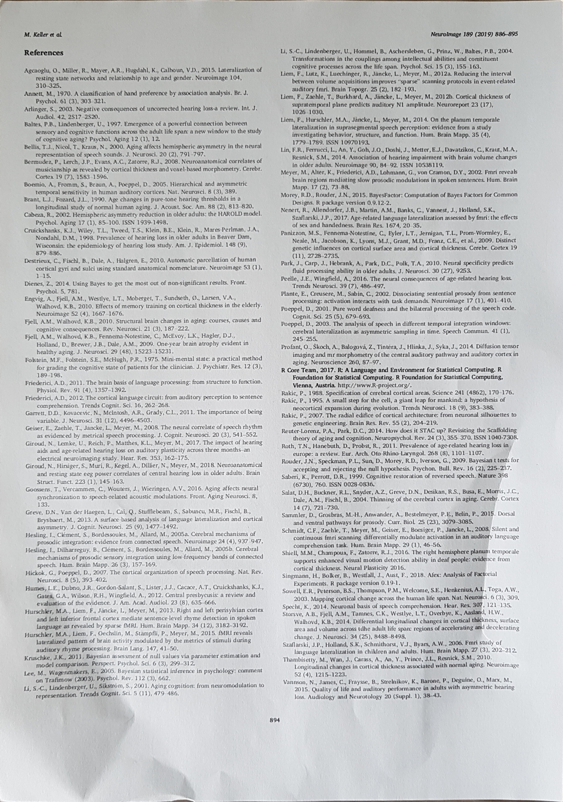

<div align="center">
  
</div>

[](LICENSE)
[](https://singularity.gwdg.de/collections/8) 

<!-- TOC depthFrom:1 depthTo:6 withLinks:1 updateOnSave:1 orderedList:0 -->

- [Document utilities](#introduction)
	- [Requirements](#requirements)
	- [Installation](#installation)
  - [Data](#data)
  - [Usage](#usage)
	  - [predict quality of document images](#predict-quality-of-document-images)
	  - [denoising image](#denoising-image)
	  - [classify documents](#classify-documents)
  - [Helper](#helper)
  - [Custom Training](#custom-training)

<!-- /TOC -->

## Introduction

### Document utilities 

Implementation of a: 

1. `CNN` to classify the document quality (reading and ocr usage) 

2. `Autoencoder` to denoise scanned document images (100-300dpi)

3. `BertTransformer` to classify multilabel documents  
- supported languages: german , english
- autotranslated labels if document is english
- supported labels: ['boxen',  'china',  'corona',  'italien',  'politik',  'python',  'rezept',  'sport',  'typisierung',  'usa']


Helper:

1. a helper util to prepare a handy image for OCR, Autoencoder etc.

---

## Requirements

- Linux (Ubuntu 20.04)
- Anaconda or miniconda
- Nvidia GPU >= 8GB VRAM (recommended for custom training)

## Installation

### local (recommended)

1. clone the repository
```
git clone URL
```
2. install requirements
```
sudo apt-get install libxml2-dev libxslt1-dev antiword unrtf poppler-utils pstotext tesseract-ocr \
libgtk2.0-dev libjpeg-dev swig
```
- install Anaconda and create an environment
```
$ cd ./Document_Scanner
$ conda env create --name <env> -f environment.yml
$ conda activate <env>

$ sudo apt install curl
$ curl -s https://packagecloud.io/install/repositories/github/git-lfs/script.deb.sh | sudo bash
$ sudo apt-get install git-lfs

$ git lfs install
$ git lfs pull    (need > 3GB)
```

### Singularity Container

- in singularity container the text summarization from Doc_Classifier is not available 

1. install singularity [Singularity installation](https://gitlab.gwdg.de/mpg-singularity/mpg-singularity/-/wikis/Singularity-unter-Linux-installieren) or `pip3 install singularity`

2. download [Singularity container](https://singularity.gwdg.de/collections)
- Collection: document-scanner
- doc_classifier contains: classify documents
- post_scan contains: predict quality of document images, denoising images, helper 

3. run container and read help section 
```
$ singularity run-help doc_classifier.sif
$ singularity run-help post_scan.sif

$ singularity run --bind PATH TO FOLDER post_scan.sif  (bind a folder or file with the container)
```

## Data
if you are interested in getting the raw data contact me:
[mailto](mailto:felixdittrich92@gmail.com)

- Denoiser: 365 items
```
denoising
        |
        |_train: 1.png, 2.png, ..
        |           
        |_train_cleaned: 1.png, 2.png, ..
        |
        |_test: 1.png, 2.png, ..
```

- Evaluator: 275 items
```
Scans
    |
    |_best: 1.jpg, 2.jpg, ..
    |
    |_worst: 1.jpg, 2.jpg, ..
```

- Text Classifier: 313 items
```
MachineLearning
              |
              |_boxenSport: name1.pdf, name2.pdf, ..
              |
              |_china: name1.pdf, name2.pdf, ..
              |
              |_chinaPolitik: name1.pdf, name2.pdf, ..
              |
              |_chinaRezept: name1.pdf, name2.pdf, ..
              |
              |_corona: name1.pdf, name2.pdf, ..
              |
              |_italienPolitik: name1.pdf, name2.pdf, ..
              |
              |_italienRezept: name1.pdf, name2.pdf, ..
              |
              |_politik: name1.pdf, name2.pdf, ..
              |
              |_python: name1.pdf, name2.pdf, ..
              |
              |_pythonTypisierung: name1.pdf, name2.pdf, ..
              |
              |_sport: name1.pdf, name2.pdf, ..
              |
              |_usaChinaCoronaPolitik: name1.pdf, name2.pdf, ..
              |
              |_usaChinaPolitik: name1.pdf, name2.pdf, ..
              |
              |_usaCoronaPolitik: name1.pdf, name2.pdf, ..
              |
              |_usaPolitik: name1.pdf, name2.pdf, ..
```

## Usage

### predict quality of document images

```
python3 predict_quality.py 
--path=PATH TO SINGLE IMAGE OR A FOLDER WITH IMAGES (NO SUBFOLDER SUPPORT)
```
<p float="left">
   
   
</p>

```
Image name : original.jpg                                    Image name : autoencoder_result.jpg 
 Predicted class : not good                                   Predicted class : not good         
 Score : 0.007537	                                      Score : 0.235914                   
```
<p float="left">
   
   
</p>

```
 Image name : output.jpg                                    Image name : lineart_300dpi.jpg
  Predicted class : good                                     Predicted class : good
  Score : 0.728959                                           Score : 0.999801 
```
### denoising image 
(recommended: Nvidia gpu >= 8gb ram)
```
python3 denoising_image.py 
--input=PATH TO SINGLE IMAGE 
--output=NAME OF THE OUTPUT FILE (Example: "out.png")
--quality=THE QUALITY FOR THE OUTPUT IMAGE 0-100 (Optional)
```
#### ORIGINAL / RESULT:
<p float="left">
  
  
</p>

### classify documents
Note: 
- if you use summarization it takes a few minutes more
- the labels will be auto translated
```
python3 classify_text.py 
--input=PATH TO SINGLE DOCUMENT OR FOLDER WITH DOCUMENTS (NO SUBFOLDER SUPPORT)
--meta=TRUE: CREATE META FILE WITH LANGUAGE AND CLASSES / KEYWORDS FROM TEXT 
--summarize=TRUE: CREATE TEXT SUMMARIZATION AND SAVES IN METAFILE (OPTIONAL IF META: TRUE)
```
#### GERMAN TEXT:
Mit 40 Prozent der Stimmen hat der Par-
tito Democratico (PD)1 bei den Europawahlen 
im Mai dieses Jahres einen herausragenden 
und in dieser Höhe auch nicht erwarteten 
Sieg errungen. Dieser Erfolg ist vor allem mit 
dem Namen Matteo Renzi verbunden. Der 
frühere Bürgermeister von Florenz hat einen 
rasanten politischen Aufstieg hinter sich. Aus 
dem eher christdemokratischen Teil des PD 
kommend (vor dem Zusammenschluss zur 
PD war er Mitglied von „La Margherita“2), gilt 
der junge, dynamisch und unkonventionell 
wirkende Renzi als neuer Hoffnungsträger 
der italienischen Politik. Er wurde im Dezem-
ber 2013 zum Vorsitzenden des PD gewählt 
und löste im Februar den eher unglücklich 
agierenden Enrico Letta als Regierungschef 
ab. Allerdings war dieser Machtwechsel nicht 
Ergebnis eines demokratischen Prozesses, 
sondern eines parteitaktischen Manövers. 
Die Europawahl gilt als nachgeholte demo-
kratische Legitimation. Mit Renzi ist zugleich 
die Hoffnung auf eine stabile Mitte-Links-
Regierung als Alternative zur jahrelangen 
Vorherrschaft Berlusconis verbunden. Renzis 
Erfolg erklärt sich vor dem Hintergrund ei-
ner völlig desolaten politischen Situation in 
Italien. Die politischen Parteien haben sich 
zum großen Teil diskreditiert und nahezu 
jede Glaubwürdigkeit verloren. In den Augen 
vieler handelt es sich bei den Politikern um 
eine nur auf ihren Vorteil bedachte Kaste“. 
Und in der Tat reißen die Skandale und Kor-
ruptionsfälle nicht ab. Erst dieser Tage wur-
de die Hauptstadt Rom von einem großen 
Korruptionsskandal in der Stadtverwaltung 
erschüttert, nachdem wenige Jahre zuvor be-
reits die Provinzverwaltung .....

#### PREDICTIONS:
```
Document name : 205_bierbaum.pdf
 
Class : boxen                                                                                                                               
Probability : 0.008778

Class : china
Probability : 0.003453

Class : corona
Probability : 0.018391

Class : italien
Probability : 0.992215

Class : politik
Probability : 0.841440

Class : python
Probability : 0.012592

Class : rezept
Probability : 0.189319

Class : sport
Probability : 0.009547

Class : typisierung
Probability : 0.012490

Class : usa
Probability : 0.006952
```
#### METAFILE:

```
{
"Filename": "205_bierbaum.pdf", 
"Date": "Sep-28-2020", 
"Time": "11:06:30", 
"Language": "de", 
"Labels": ["italien", "politik"], 
"Keywords": ["geben deutschen italien politik deutschland deutsche menschen regierung ganz politischen"], 
"Summary": "Partito democratico pd ist mitglied des parteivorstandes die linke vorsitzender der internationalen kommission and professor fuer betriebswirtschaft. Die europawahl gilt als nachgeholte demokratische legitimation mit renzi ist zugleich die hoffnung auf eine stabile mittelinksregierung."
}
```

#### ENGLISH TEXT:
So can the EU; now indeed the EU must prove 
that it can do better than after the 2008 financial 
crisis and protect the livelihood of its citizens 
rather than just the banks. After the 2016 British 
vote for Brexit, leaders of all colours finally 
discovered the need for a social Europe – and 
then forgot about it again. The EU cannot afford 
to make this mistake twice: strong Keynesian 
policies must create an economically vibrant and 
socially just Union. (How the UK will fare, on its 
own now and under a Prime Minister who 
unfortunately seems to have taken his cue from 
Trump, is another question). 
 
If one power falls behind the other two, it will 
lose global markets and influence to the benefit 
of the others. But, paradoxically, if one really 
collapses, that risks pulling down the others as 
well, so to some extent all three have an interest 
in a minimal recovery of the others (though not 
all of their leaders may see it as such). 
 
At the same time, the corona crisis will accelerate 
US and even EU action, which they were 
envisaging already, to reduce the interdependence 
with China (and others) by reviewing the supply 
chains in critical sectors. Chinese attempts to use 
the crisis to increase their presence in Europe and 
America (provided Beijing can mobilise the 
means in view of its undoubtedly underreported 
domestic problems) will be viewed with a lot 
more suspicion this time. Nevertheless, this is 
about reorganizing globalisation, not undoing it – 
at basis, deep economic interdependence will 
remain.

#### PREDICTIONS:
```
Document name : SPB126-sven-corona-260320.pdf
 
Class : boxen                                                                                                                               
Probability : 0.002254

Class : china
Probability : 0.014674

Class : corona
Probability : 0.996145

Class : italien
Probability : 0.003417

Class : political          <- auto translated
Probability : 0.988726

Class : python
Probability : 0.002591

Class : rezept
Probability : 0.002722

Class : sport
Probability : 0.002718

Class : typisierung
Probability : 0.002515

Class : usa
Probability : 0.990106
```
#### METAFILE:

```
{
"Filename": "SPB126-sven-corona-260320.pdf", 
"Date": "Sep-28-2020", 
"Time": "14:16:51", 
"Language": "en", 
"Labels": ["corona", "political", "usa"], 
"Keywords": ["chinese chinas trade education growth security market military reforms percent"], 
"Summary": " corona crisis is test of legitimacy for every government though not necessarily for the political system as such. Crisis may strengthen opposition to xi jinping within the chinese communist party which might have consequences for the succession. Great powers instrumentalise everything so it was only to be expected that they would instrumentalise the coronavirus."
}
```

## Helper

- rotate the image correctly and crop the relevant part / add sharpening with --sharp=True
```
python3 handy_helper/helper.py 
--input=PATH TO SINGLE IMAGE 
--output=NAME OF THE OUTPUT FILE (Example: "out.png")
--sharp=True (Optional)
--quality=THE QUALITY FOR THE OUTPUT IMAGE 0-100 (Optional)
--
```
#### ORIGINAL / RESULT

<p float="left">
   
   
</p>

## Custom Training
- NOTE: If you want to train your own data, look in the data section in which structure the data must be available

### Evaluator
```
evaluator/Dataset.py -> Line 16 -> path to your Dataset
evaluator/CNN.py -> Linie 141/181 -> change save path 
cd Document_Scanner/evaluator
python3 CNN.py
predict_quality.py -> Line 18 -> change to your model stored path
```
### Denoiser
```
denoiser/Autoencoder.py -> Line 30/31 -> path to your Dataset
denoiser/Autoencoder.py -> Line 124 / 158 -> change save path
cd Document_Scanner/denoiser
python3 Autoencoder.py
denoising_image.py -> Line 25 -> change to your model stored path
```
### Multilabel Classifier
```
cd Document_Scanner
python3 text_classifier/train_custom.py 
--path=PATH TO THE FOLDER WITH DOCUMENTS
(OPTIONAL)
--save_dataset=SAVE THE DATASET FOR RENEWED TRAINING (BOOL)
--maxlen=EACH DOCUMENT CAN BE OF MOST MAXLEN WORDS
--max_features=MAX NUM OF WORDS TO CONSIDER IN VOCABULARY
--batch_size=SIZE OF PARALLEL TRAINED DATA STACK
--epochs=SIZE OF TRAINING ITERATIONS
--lda_n_features=NUMBER OF EXTRACTED TOPICS
--lda-threshold=PROBABILITIES BELOW THIS VALUE ARE FILTERED OUT
```

```
python3 classify_text.py 
--custom=True: USES YOUR OWN TRAINED MODEL
--input=PATH TO SINGLE DOCUMENT OR FOLDER WITH DOCUMENTS (NO SUBFOLDER SUPPORT)
--meta=TRUE: CREATE META FILE WITH LANGUAGE AND CLASSES / KEYWORDS FROM TEXT 
--summarize=TRUE: CREATE TEXT SUMMARIZATION AND SAVES IN METAFILE (OPTIONAL IF META: TRUE)
```

- Example:
```
(doc) USER@PC:~/Desktop/Document_Scanner > python3 text_classifier/train_custom.py --path=/home/user/Desktop/MachineLearning/ --save_dataset=True
(doc) USER@PC:~/Desktop/Document_Scanner > python3 classify_text.py --path=/home/user/Desktop/MachineLearning/boxenSport/  --meta=True --summarize=True --custom=True
```
- For completely fresh training delete custom_data folder 
 
